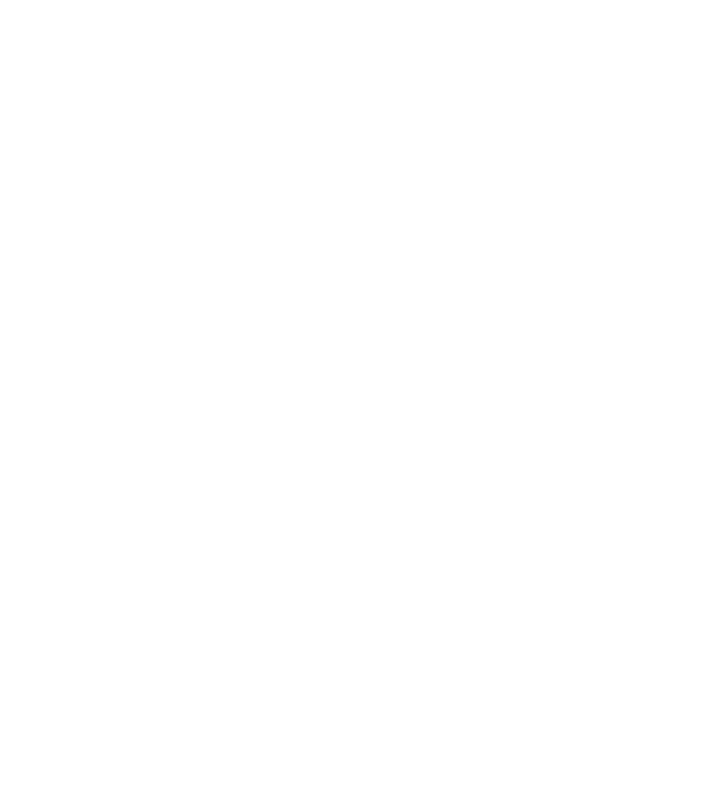
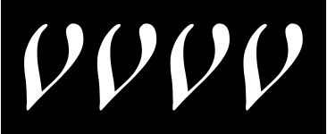
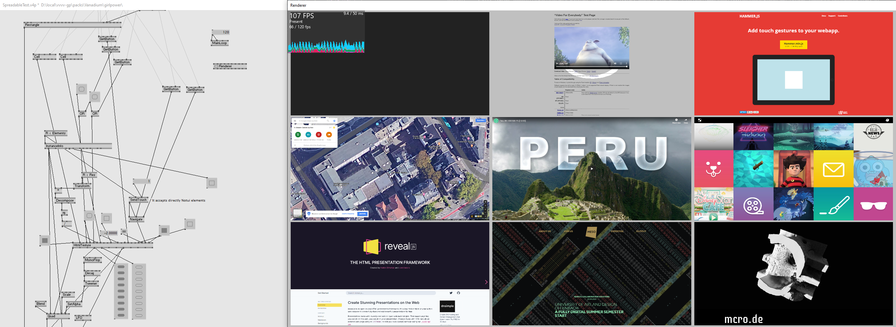
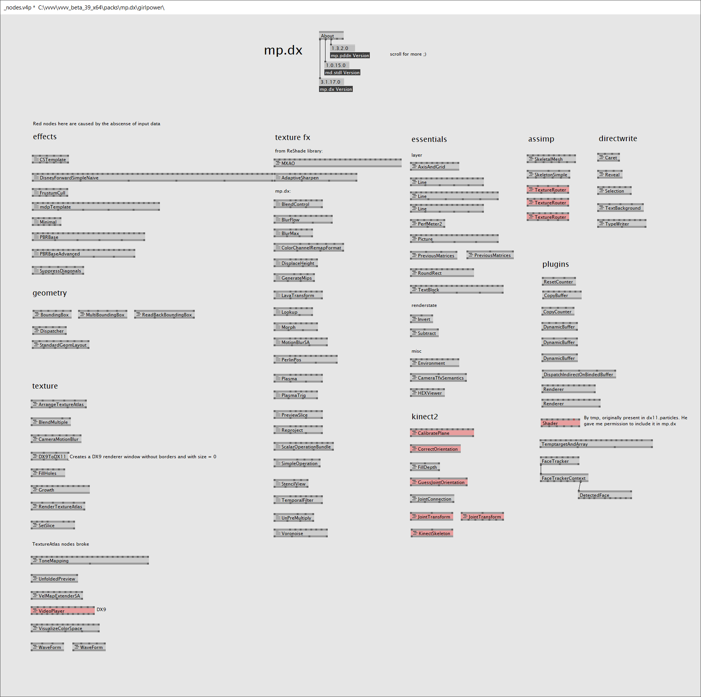
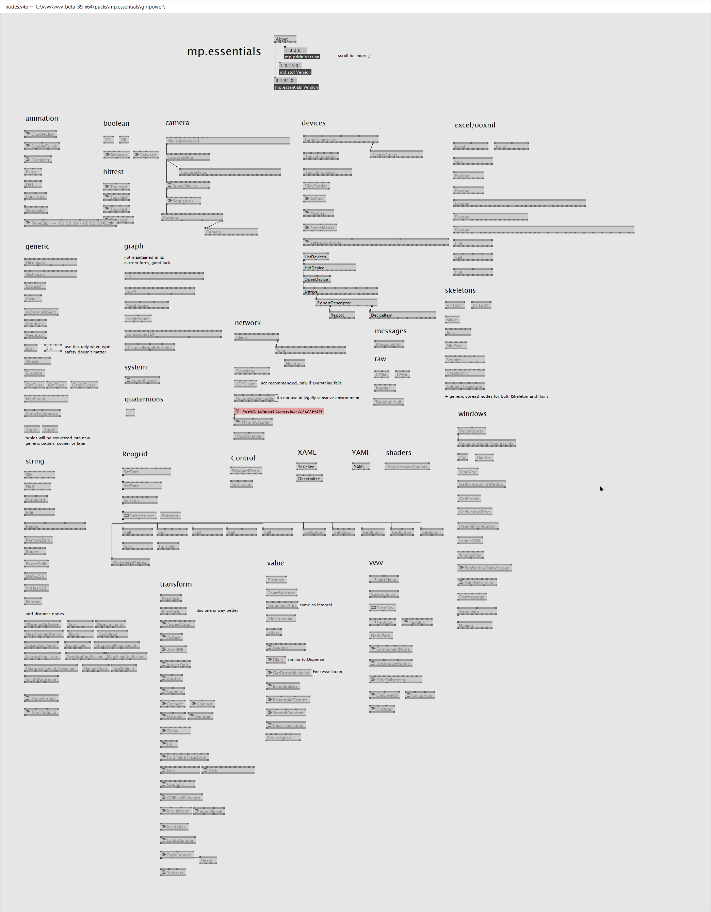

# Unreal plugins

## [Open Unreal SpaceMouse](https://github.com/microdee/OpenUnrealSpaceMouse)

&nbsp;

Control Editor viewports with the best camera control device out there, even without the official drivers.

----

&nbsp;

High level project automations for Unreal Engine in C#, using the great [Nuke build tool](https://nuke.build).

* Use Unreal tools from command line and in CI/CD
* Generate boilerplates
* Implicitly composable execution graph
* Fluent API UBT/UAT wrappers in C#
* Install C++ libraries with ease
* And more!

----

&nbsp;

Generic extensions for [Nuke build tool](https://nuke.build).

* Compose builds with automatically discovered plugins
* Manipulate file/folder structures with expressive declarative syntax
* `Tool` delegate composition

----

## [MCRO](https://mcro.de/mcro??literal)

A C++ utilities library for Unreal Engine for writing code in style for a more civilised age.

----
# VVVV plugins

## [VPM](https://vvvvpm.github.io)
Vvvv Package Manager

Decentralized package manager for vvvv. Without it, contribution dependency is a completely manual endeavour in vvvv.

----

## [Notuiv](https://vvvv.org/contribution/notuiv)
Advanced UI interaction library in 3D space.

<iframe src="https://player.vimeo.com/video/268043752?color=ffffff&amp;title=0&amp;byline=0&amp;portrait=0" width="640" height="370" frameborder="0" webkitallowfullscreen="" mozallowfullscreen="" allowfullscreen=""></iframe>

----

## [Vanadium](https://github.com/meso-unimpressed/Vanadium)
Industry-proof, fast and GPU accelerated HTML renderer for vvvv using a custom build of CEF (Chromium Embedded Framework).

----

## [mp.dx](https://vvvv.org/contribution/mp.dx)
and mp.essentials

A large collection of general purpose nodes and ecosystems. Think of it as a second addonpack. It also includes as dependencies:

* **[mp.fxh](https://github.com/microdee/mp.fxh)** a HLSL header library tackling many common problems
* **[mp.pddn](https://github.com/microdee/mp.pddn)** a library to ease manipulation of nodes and pins in vvvv.
* **[md.stdl](https://github.com/microdee/md.stdl)** a C# standard library of misc things.
  * This is being deprecated tho in favor of its .NET Core port which doesn't rely on VVVV.Utils anymore

